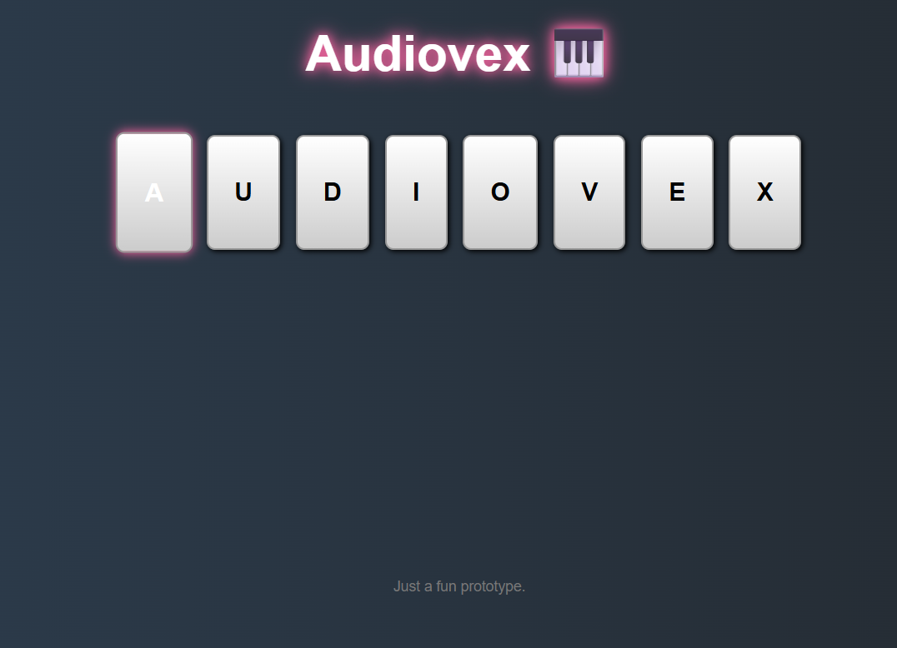

# 🎹 Audiovex – Keyboard-Controlled Virtual Piano

Audiovex is a browser-based virtual piano where keys on your keyboard trigger piano sounds.  
This is just a fun prototype built to explore interactive audio with keyboard events.

---

## Features
- Play piano notes via keyboard
- Highlights keys when pressed
- Animated background and responsive UI

---

## Tech Stack
- HTML
- CSS (with animation)
- Vanilla JavaScript

---

## Screenshots

### Audiovex Demo

---

## How to Run
1. Clone or download this repository.
2. Ensure the `sounds/` folder contains the required audio files.
3. Open `index.html` in any modern web browser.

No installation or build tools needed — runs entirely in the browser!

---

## Ideas to Explore
- Add more musical keys
- Visualize sound waves or frequencies
- Touch/mouse support
- Sound packs or themes

---

> *This is a simple, creative prototype — feel free to remix and expand it!*
